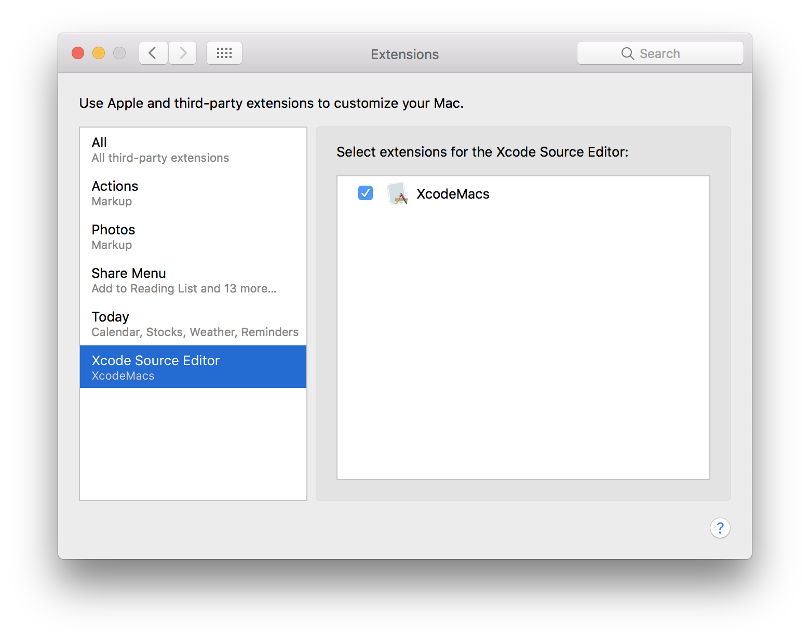
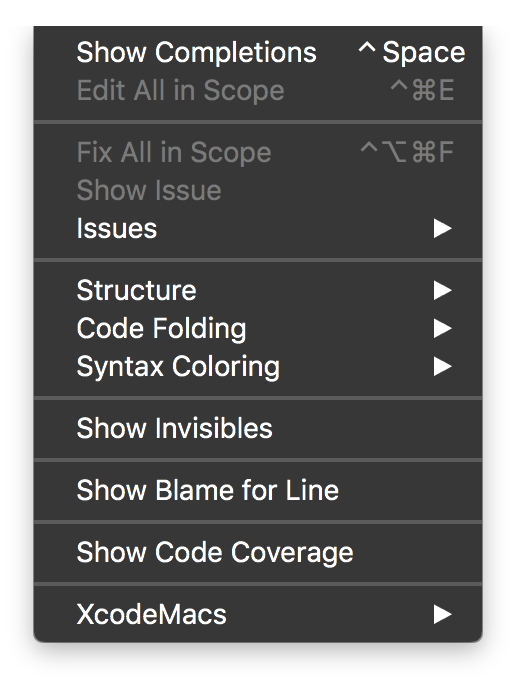

# XcodeMacs

I first started using the [Emacs text editor](https://www.gnu.org/software/emacs/) in high school,
got hooked, and continued to use it later in academia and the sofware engineering industry. As a
consequence, I've accumulated over the years a lot of custom editor commands that make text editing
a pleasant experience. This is my attempt to convert them to Xcode 8+ source extensions. The
original Elisp implementation is also included as a commentary for each command class.

The Xcode source extensions API is still limited, so there's some commands that I cannot
port. Radars for the current API limitations with my suggestions to the Developer Tools group at
Apple will also be linked here.

## Installation

- Download the latest version from the [GitHub release page](https://github.com/danielmartin/XcodeMacs/releases/)
- Unzip and move the XcodeMacs.app file into your `/Applications` folder.
- Go to macOS System Preferences > Extensions.
- Select _Xcode Source Editor_ from the left menu,
- Ensure there is a checkmark in front of _XcodeMacs_

After doing these steps, restart Xcode. You should now see the entry _XcodeMacs_ in Xcode in the
_Editor_ menu when you are inside a source file. In a true Emacs spirit, feel free to associate the
commands with your favorite keybindings after you've installed them.

